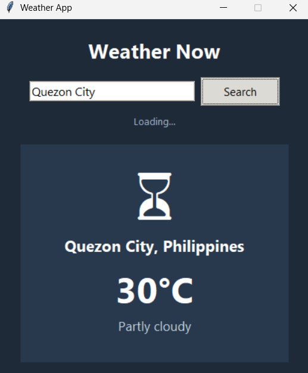

# 🌤️ Weather App (Python + Tkinter)

A simple desktop GUI weather app that shows live weather for any city.
No API key or signup required — powered by the free [wttr.in](https://wttr.in) JSON API.

## Features
- Search weather by city name
- Displays temperature, "feels like", humidity, and wind speed
- Weather-condition emoji icon
- Background network requests (UI never freezes)
- Clean dark-themed interface

## Screenshot
<p align="center">
  
</p>
## Setup

```bash
git clone https://github.com/<your-username>/weather-app.git
cd weather-app
pip install -r requirements.txt
python weather_app.py
```

## How it works
The app queries `https://wttr.in/{city}?format=j1`, which returns structured
JSON weather data for free with no authentication. The response is parsed for
current conditions and rendered in a Tkinter window.

## Possible improvements
- Add a multi-day forecast view
- Switch between °C and °F
- Add city search history / favorites
- Swap in the OpenWeatherMap API for more detailed data and icons

## Tech stack
- Python 3
- Tkinter (GUI)
- requests (HTTP calls)
- wttr.in (weather data source)